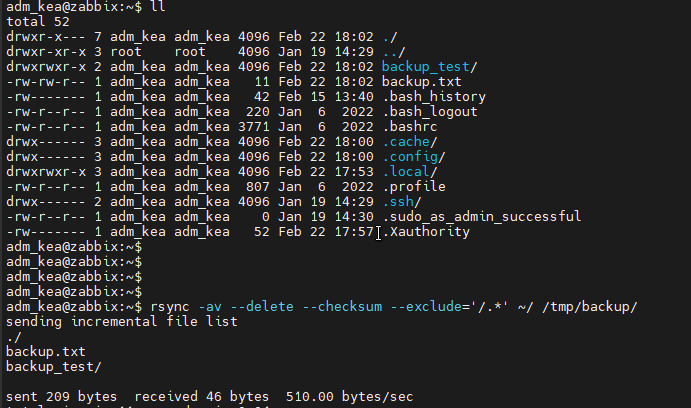
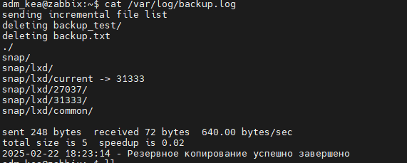
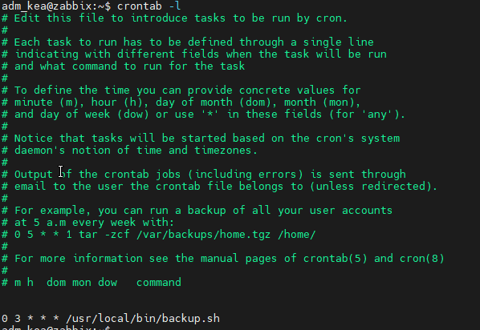

# Домашнее задание к занятию 3 «Резервное копирование» - Крюков Егор

------

### Задание 1
- Составьте команду rsync, которая позволяет создавать зеркальную копию домашней директории пользователя в директорию `/tmp/backup`
- Необходимо исключить из синхронизации все директории, начинающиеся с точки (скрытые)
- Необходимо сделать так, чтобы rsync подсчитывал хэш-суммы для всех файлов, даже если их время модификации и размер идентичны в источнике и приемнике.
- На проверку направить скриншот с командой и результатом ее выполнения

------

### Решение 

```bash
rsync -av --delete --checksum --exclude='/.*' ~/ /tmp/backup/

```



------

### Задание 2

- Написать скрипт и настроить задачу на регулярное резервное копирование домашней директории пользователя с помощью rsync и cron.
- Резервная копия должна быть полностью зеркальной
- Резервная копия должна создаваться раз в день, в системном логе должна появляться запись об успешном или неуспешном выполнении операции
- Резервная копия размещается локально, в директории /tmp/backup
- На проверку направить файл crontab и скриншот с результатом работы утилиты.

------

### Решение

```bash
#!/bin/bash

BACKUP_DIR="/tmp/backup"
LOG_FILE="/var/log/backup.log"

# Запуск резервного копирования
rsync -av --delete --checksum --exclude='/.*' ~/ "$BACKUP_DIR" &>> "$LOG_FILE"

# Логирование результата
if [ $? -eq 0 ]; then
    echo "$(date '+%Y-%m-%d %H:%M:%S') - Резервное копирование выполнено" >> "$LOG_FILE"
else
    echo "$(date '+%Y-%m-%d %H:%M:%S') - Ошибка резервного копирования" >> "$LOG_FILE"
fi

```




